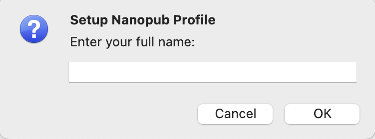
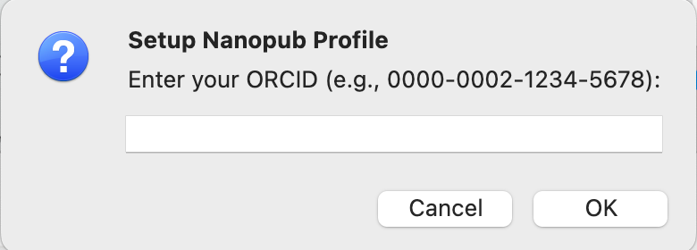
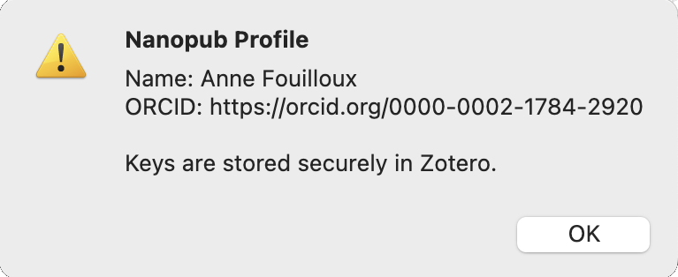
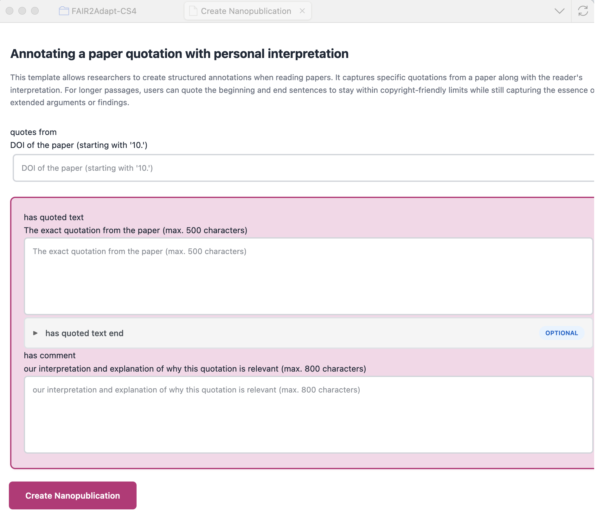

# Quick Start Guide

Create your first nanopublication in 5 minutes - **entirely within Zotero!**

## Prerequisites

- Zotero 7.0+ installed
- Plugin installed ([installation guide](installation.md))
- ORCID account ([get one free](https://orcid.org))
- Internet connection

---

## Step 1: Set Up Your Profile (One-time, 2 minutes)

Your nanopubs are signed with your ORCID for proper attribution.

1. In Zotero, go to **File → Setup Nanopub Profile**
2. Enter your full name (e.g., "Jane Smith")

3. Enter your ORCID (e.g., `0000-0002-1234-5678` or `https://orcid.org/0000-0002-1234-5678`)

4. Click **OK**
5. To check your profile, go to  **File → Show  Nanopub Profile** 

The plugin generates cryptographic keys and stores them securely in Zotero.

**✓ Done!** You won't need to do this again.

---

## Step 2: Choose a Paper (30 seconds)

Pick any paper from your Zotero library that you want to annotate.

**Good choices for your first nanopub:**

- A paper you recently read and want to comment on
- Your own publication you want to cite semantically
- A paper you're using in your literature review

---

## Step 3: Start Creating a Nanopub (1 minute)

**Option A: Right-click menu** (recommended)
1. **Right-click** the paper
2. Hover over **"Create Nanopublication"**
3. Choose a template from the submenu:
   - **📚 Citation**: Describe paper relationships.  *Good for first-time users*
   - **📝 Explain your citation**: Select the text you’re citing and explain why you reference it.  *Good for explaining exactly which part you cite and why.*
   - **🌍 Geographical Coverage**: Identify the geographical area discussed in the paper and support it with a quote. *Good for documenting which geographical area is discussed in the paper.*

**Option B: File menu**
1. Go to **File → Create Nanopublication**
2. Choose a template from the submenu

We’re adding new templates as we develop the Nanopublication Zotero plugin — if one’s missing, let us know on [GitHub](https://github.com/ScienceLiveHub/zotero-nanopub-plugin/issues/new).

---

## Step 4: Fill Out the Form in Zotero (2 minutes)

A new tab opens in Zotero with an interactive form:

The form is automatically pre-filled with information from your selected paper:
- Author information

**Just add your content:**

- DOI or URI when requested
- For "Explain your citation" template: Add a quote from the paper you’re referencing and explain why you think it’s worth citing.
- The form shows clear labels for each field
- Required fields are marked with *

**Example for a Explain your citation:**

- After selecting, "Annotate a paper quotation" as the type of nanopublication, view the paper (e.g. PDF Viewer) and select a short quote in the paper. If the text selected is more than 500 characters, we suggest to select the first sentence (short). Then select the last sentence from the quote and paste it in the optional field form "has quoted text end".

- Then, in the "has comment" field, explain why you selected this quote, what the passage claims, and why it’s relevant.

Click **"Create Nanopublication"** when done. Please bear in mind that you need to set up your Nanopub profile before creating nanopublication in Zotero.

---

## Step 5: Watch It Publish (30 seconds)

The plugin automatically:

1. **Generates** the nanopublication in TriG format
2. **Signs** it with your ORCID and keys (using WASM cryptography)
3. **Publishes** it to the nanopub network
4. **Creates** a rich note attached to your Zotero item

You'll see a success message with your nanopub URI! 

---

## Step 6: View Your Nanopub

You can add your newly published nanopublication as a note to the paper you selected to generate it from.

Once added a new window pops up: *Success: Nanopublication attached successfully! Check the notes attached to your selected item.*

You can check and display the content of the note by clicking on it.

The rich note includes:
- Formatted display
- Your name and ORCID
- Publication date
- Your assertion/comment
- Link to view online
- Share/cite nanopublication

**View online:** Click the URI link to see your nanopub on the nanopub network.

**Search for your work:** Visit [Nanodash](https://nanodash.knowledgepixels.com/) and search for your ORCID to see all your nanopubs.

---

## What Just Happened?

You created a **nanopublication** - a tiny, semantic, citable unit of knowledge that:

- Is permanently stored on the nanopub network
- Has a persistent identifier (URI)
- Is cryptographically signed with your ORCID
- Is machine-readable (RDF/TriG format)
- Is discoverable by other researchers
- Is linked to the paper in your Zotero library

**And you did it all without leaving Zotero!**

---

## Next Steps

### Try More Features

**Search for related nanopubs:**

1. Right-click any paper
2. Select **"Search for Related Nanopublications"**
3. Discover what others have published about this paper

**Try a different template:**

- Create another nanopub
- Choose **"📚 Citation"** template
- Use CiTO (Citation Typing Ontology) to describe paper relationships

**Import a nanopub:**

- Find an interesting nanopub URI (search on Nanodash)
- **File → Import Nanopublication as New Item**
- It's added to your library

### Learn More

- [Feature overview](../user-guide/features.md) - Everything the plugin can do
- [Template types](../user-guide/templates.md) - Detailed guide to each template

---

## Common Questions

**Q: Where does the form open?**  
A: In a new tab within Zotero! No external browser window, no website.

**Q: Do I need to be online?**  
A: Yes - the plugin needs to load templates and publish to the nanopub network.

**Q: Can I edit a published nanopub?**  
A: No - nanopubs are permanent (that's a feature for citability). But you can publish a new version.

**Q: What if I don't have a DOI for my paper?**  
A: That's fine! The plugin will use the Zotero URI or you can provide any URI.

**Q: Who can see my nanopubs?**  
A: Nanopubs are public by default - published to the open nanopub network. This enables discovery and citation.

---

## Need Help?

- [Troubleshooting guide](../technical/troubleshooting.md)
- [GitHub Issues](https://github.com/ScienceLiveHub/zotero-nanopub-plugin/issues)
- [Science Live Platform](https://sciencelive4all.org)

---

**Congratulations! You're publishing semantic knowledge! 🎉**
