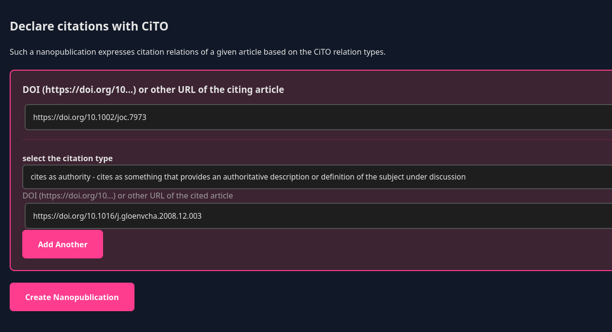
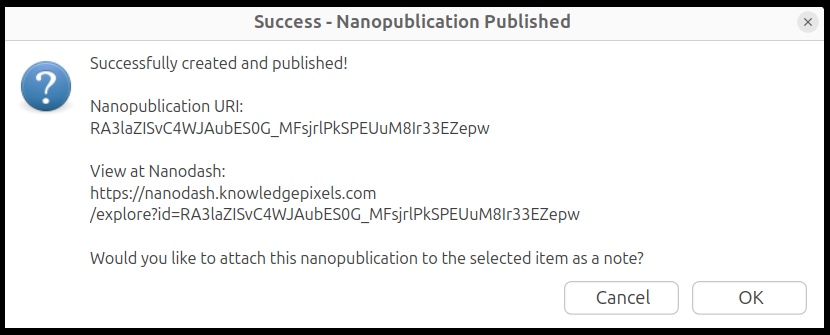
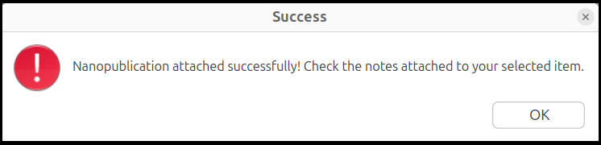
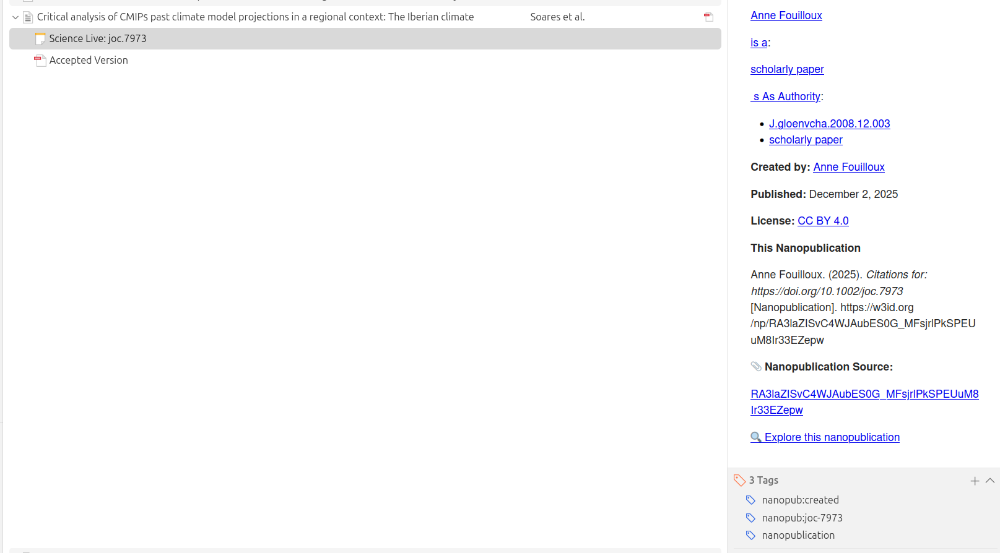

# Quick Start Guide

Create your first nanopublication in 5 minutes - **entirely within Zotero!**

## Prerequisites

- Zotero 7.0+ installed
- Plugin installed ([installation guide](installation.md))
- ORCID account ([get one free](https://orcid.org))
- Internet connection

---

## Step 1: Set Up Your Profile (One-time, 2 minutes)

Your nanopubs are signed with your ORCID for proper attribution.

1. In Zotero, go to **Zotero → Settings** or if Zotero menu does not exist, go to **Edit → Settings**.
2. Select the **Science Live** Panel
2. Enter your full name (e.g., "Jane Smith")
3. Enter your ORCID (e.g., `0000-0002-1234-5678` or `https://orcid.org/0000-0002-1234-5678`)
4. Click **Save Profile**

5. To check your profile, click on **View Profile** on the same setup panel.

The plugin generates cryptographic keys and stores them securely in Zotero.

**✓ Done!** You won't need to do this again.

---

## Step 2: Choose a Paper (30 seconds)

Pick any paper from your Zotero library that you want to annotate.

**Good choices for your first nanopub:**

- A paper you recently read and want to comment on
- Your own publication you want to cite semantically
- A paper you're using in your literature review

---

## Step 3: Start Creating a Nanopub (1 minute)

**Option A: Right-click menu** (recommended)

1. **Right-click** the paper
2. Hover over **"Create Nanopublication"**
3. Choose the CiTO template from the submenu:
   - **📚 Citation**: Describe paper relationships.  *Good for first-time users*

**Option B: File menu**

1. Go to **File → Create Nanopublication**
2. Choose a template from the submenu

We’re adding new templates as we develop the Nanopublication Zotero plugin — if one’s missing, let us know on [GitHub](https://github.com/ScienceLiveHub/zotero-nanopub-plugin/issues/new).

---

## Step 4: Fill Out the Form in Zotero (2 minutes)

A new tab opens in Zotero with an interactive form:

The form is automatically pre-filled with information from your selected paper:

- DOI of the paper

!!! note
    Be careful since the DOI of the paper will be filled everywhere! For the CiTO nanopublication form, we need to update the second one that corresponds to the paper cited in the item you selected.

- Author information 

!!! note
    The Author information is not visible from the form but taken from your Science Live keys as explained during the set up.

- Select the citation type and enter the DOI of the paper you want to reference. The paper should appear in the list of references, but at the moment no checks are performed.

!!! note
    In the example above, we use *cites as authority* as the citation type, and the DOI of the cited paper is: [https://doi.org/10.1016/j.gloenvcha.2008.12.003](https://doi.org/10.1016/j.gloenvcha.2008.12.003).

- Click on "**Create Nanopublication**". You will be notified once the nanopublication is successfully created and added as a note under your item.

!!! warning
    A nanopublication is immediately created when you click on "Create Nanopublication".

If you want to add the newly created nanopublication as a note under your item, select **OK**; otherwise, select **Cancel**.

---

## Step 5: View Your Nanopublication in Zotero

Once the nanopublication is added as a note to your selected item, you can check and display its content by clicking on it.

The rich note includes:

- Formatted display
- Your name and ORCID
- Publication date
- Your assertion/comment
- Link to view online
- Share/cite nanopublication

**View online:** Click the URI link to see your nanopub on the nanopub network.

---

## What Just Happened?

You created a **nanopublication** - a tiny, semantic, citable unit of knowledge that:

- Is permanently stored on the nanopub network
- Has a persistent identifier (URI)
- Is cryptographically signed with your ORCID
- Is machine-readable (RDF/TriG format)
- Is discoverable by other researchers
- Is linked to the paper in your Zotero library

**And you did it all without leaving Zotero!**

---

## Next Steps

### Try More Features

**Search for related nanopubs:**

1. Right-click any paper
2. Select **"Search for Related Nanopublications"**
3. Discover what others have published about this paper

**Try a different template:**

- Create another nanopub
- Choose **"📚 Comment on paper"** template
- Use CiTO (Citation Typing Ontology) to comment on a paper.

**Import a nanopub:**

- Find an interesting nanopub URI (search on the Science Live Platform or directly on Nanodash)
- **File → Import Nanopublication as New Item**
- It's added to your library

!!! note
    If you want to add a nanopublication as a note under an item, please select **File → Import Nanopublication (Attach to Item)" or right click on a given item and select "Attach Nanopublication".

### Learn More

- [Feature overview](../user-guide/features.md) - Everything the plugin can do
- [Template types](../user-guide/templates.md) - Detailed guide to each template

---

## Common Questions

**Q: Where does the form open?**  
A: In a new tab within Zotero! No external browser window, no website.

**Q: Do I need to be online?**  
A: Yes - the plugin needs to load templates and publish to the nanopub network.

**Q: Can I edit a published nanopub?**  
A: No - nanopubs are permanent (that's a feature for citability). But you can publish a new version.

**Q: What if I don't have a DOI for my paper?**  
A: That's fine! The plugin will use the Zotero URI or you can provide any URI.

**Q: Who can see my nanopubs?**  
A: Nanopubs are public by default - published to the open nanopub network. This enables discovery and citation.

---

## Need Help?

- [Troubleshooting guide](../technical/troubleshooting.md)
- [GitHub Issues](https://github.com/ScienceLiveHub/zotero-nanopub-plugin/issues)
- [Science Live Platform](https://sciencelive4all.org)

---

**Congratulations! You're publishing semantic knowledge! 🎉**
