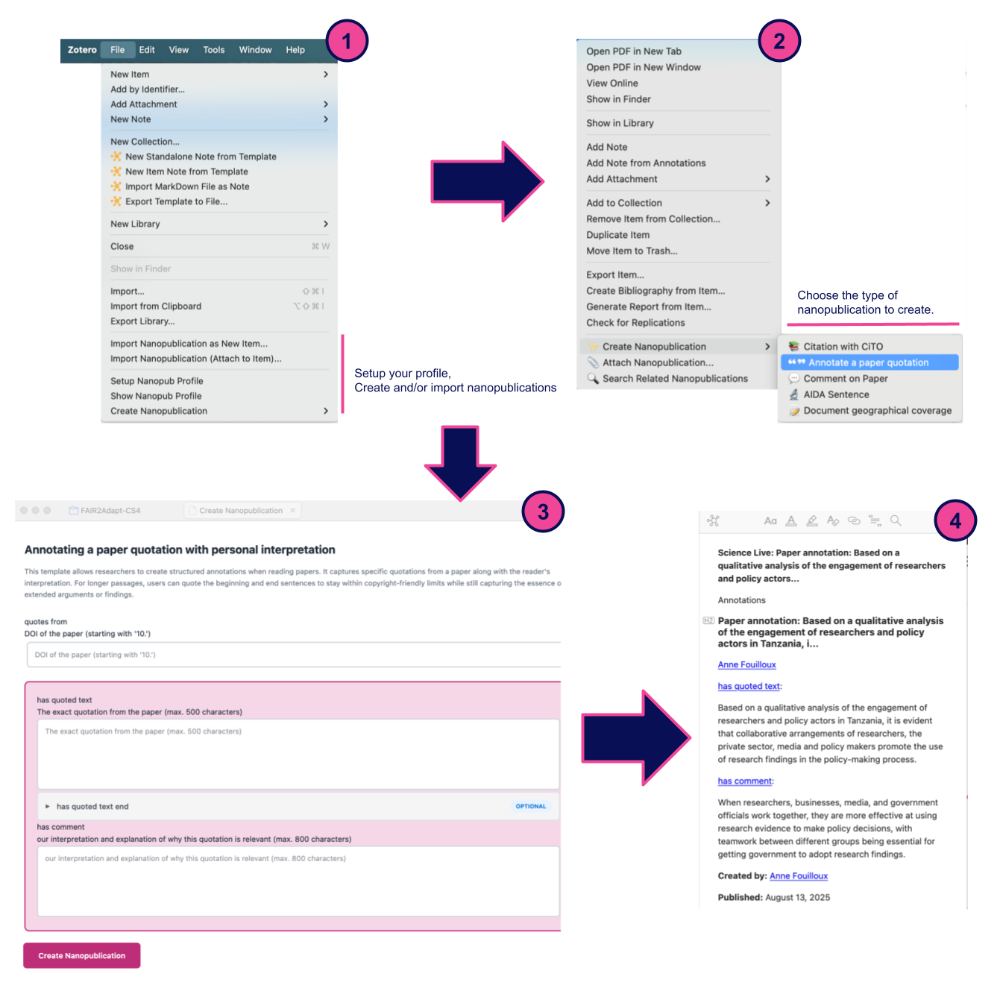

# Zotero Nanopublication Plugin

Transform your research workflow into semantic knowledge creation - **all within Zotero.**

[Get Started](getting-started/installation.md){ .md-button .md-button--primary }
[View on GitHub](https://github.com/ScienceLiveHub/zotero-nanopub-plugin){ .md-button }

---

## What This Plugin Does

The Zotero Nanopublication Plugin brings semantic web publishing **directly into Zotero** - no external websites, no context switching.

!!! tip "Key Benefits"

    - **All In-Zotero** - Create nanopubs without leaving your workspace
    - **Embedded Forms** - Smart forms generated from templates, rendered in Zotero tabs
    - **Discover** - Find related nanopublications from other researchers
    - **FAIR Principles** - Contribute to Findable, Accessible, Interoperable, Reusable science
    - **ORCID Signed** - Cryptographically sign your work for proper attribution

---

## Quick Overview

=== "For Readers"

    **Annotate your readings semantically.**  
    Transform reading notes into structured, citable statements. Create nanopubs about papers as you read them - all in Zotero.

=== "For Reviewers"

    **Write machine-readable reviews.**  
    Use CiTO (Citation Typing Ontology) to describe paper relationships. Others can discover and build upon your evaluations.

=== "For Researchers"

    **Publish semantic claims.**  
    Make formal research assertions with AIDA templates. Your claims become part of the global knowledge graph, signed with your ORCID.

---

## Current Features (v2.0.0)

- **In-Zotero Form Creation** - Entire workflow happens in Zotero tabs
- **Template Browser** - Choose from popular templates with one click
- **Multiple Templates** - CiTO, AIDA, geographical coverage, and more
- **Auto-fill** - Paper metadata automatically populated
- **Automatic Signing** - Uses WASM cryptography with your ORCID
- **Direct Publishing** - Publishes to nanopub network instantly
- **Rich Notes** - Beautiful display of nanopubs with `@sciencelivehub/nanopub-view`
- **Search Integration** - Discover nanopubs about papers in your library
- **Import/Attach** - Add nanopubs as items or attach as notes
- **Dark Mode** - Seamless integration with Zotero's theme

---

## Coming Soon (v2.1.0)

🚧 **PDF Text Selection** - Create nanopubs directly from highlighted text

Want updates? [Watch the repository](https://github.com/ScienceLiveHub/zotero-nanopub-plugin) ⭐

---

## How It Works

1. Right-click any paper in Zotero
2. Choose "Create Nanopublication" → Select template
3. Form opens in new Zotero tab (auto-filled with paper info)
4. Fill in your content
5. Click "Create & Publish"
6. Plugin signs with your ORCID and publishes automatically
7. Beautiful rich note attached to your item

**No browser windows. No external websites. All in Zotero!**

---

## Getting Help

!!! info "Documentation Sections"

    === "👤 For Users"

        - **[Installation Guide](getting-started/installation.md)** - Install in 2 minutes
        - **[Quick Start](getting-started/quick-start.md)** - First nanopub in 5 minutes
        - **[Feature Guide](user-guide/features.md)** - Complete capabilities overview
        - **[Templates Guide](user-guide/templates.md)** - When to use which template

    === "🔧 For Developers"

        - **[Architecture](technical/architecture.md)** - How it works under the hood
        - **[API Integration](technical/api-integration.md)** - Integration details
        - **[Contributing](development/contributing.md)** - Join development

---

## What are Nanopublications?

!!! question "New to Nanopublications?"

    Nanopublications are the smallest units of publishable information in machine-readable format:
    
    - **Assertion** - The core claim or statement
    - **Provenance** - Who made it, when, and how
    - **Publication Info** - Metadata about the nanopub itself
    
    This plugin helps you create nanopublications from your Zotero workflow, making your insights part of the semantic web of scientific knowledge.

    [Learn More →](http://nanopub.net){ .md-button }

---

## Part of Science Live Platform

This plugin is part of [Science Live](https://sciencelive4all.org) - transforming research into connected, FAIR knowledge bricks.

**Science Live enables:**

- 🧱 **Knowledge Bricks**: Stackable, reusable research components
- 🎯 **FAIR Principles**: Findable, Accessible, Interoperable, Reusable
- 💰 **Credit System**: Recognition for quality contributions *(coming soon)*
- 🌍 **Open Science**: Transparent, collaborative research

**Roadmap Integration:**

- January 2026: Beta launch
- June 2026: Public launch
- Credit system integration
- Travel fund for contributors

[Visit Science Live →](https://sciencelive4all.org){ .md-button }

---

## System Requirements

- **Zotero:** Version 7.0 or later
- **Internet:** Required for loading templates and publishing
- **ORCID:** Free account at [orcid.org](https://orcid.org)

**Supported Platforms:**

- Windows 10/11
- macOS 11+ (Intel and Apple Silicon)
- Linux (Ubuntu 20.04+, Fedora 34+)

---

## Quick Links

- 📖 [Documentation](getting-started/installation.md)
- 💻 [GitHub Repository](https://github.com/ScienceLiveHub/zotero-nanopub-plugin)
- 🐛 [Report Issue](https://github.com/ScienceLiveHub/zotero-nanopub-plugin/issues)
- 🌐 [Science Live](https://sciencelive4all.org)

---

## License & Credits

**License:** MIT

**Created by:** [ScienceLiveHub](https://github.com/ScienceLiveHub)  
**Contact:** contact@vitenhub.no

**Built with:**

- [@sciencelivehub/nanopub-create](https://github.com/ScienceLiveHub/nanopub-create) - Form generation and signing
- [@sciencelivehub/nanopub-view](https://github.com/ScienceLiveHub/nanopub-view) - Rich note display
- [nanopub-rs](https://github.com/vemonet/nanopub-rs) - WASM signing library

**Powered by:** [Nanopublication Network](http://nanopub.net) via [Knowledge Pixels](https://knowledgepixels.com)

---

**Start publishing semantic knowledge today!** 🚀

