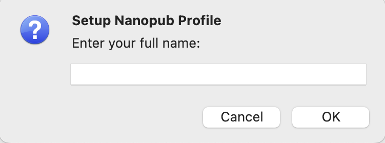
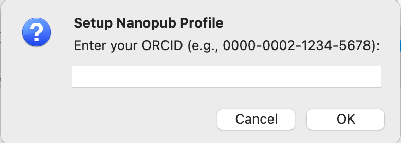
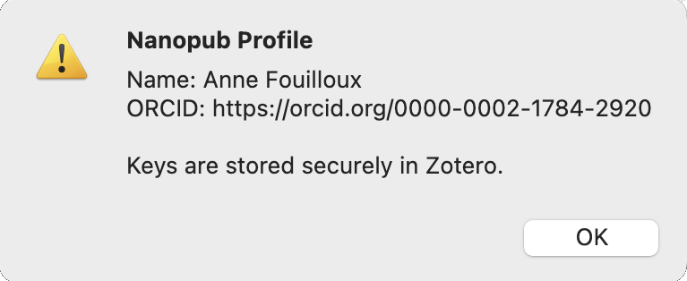
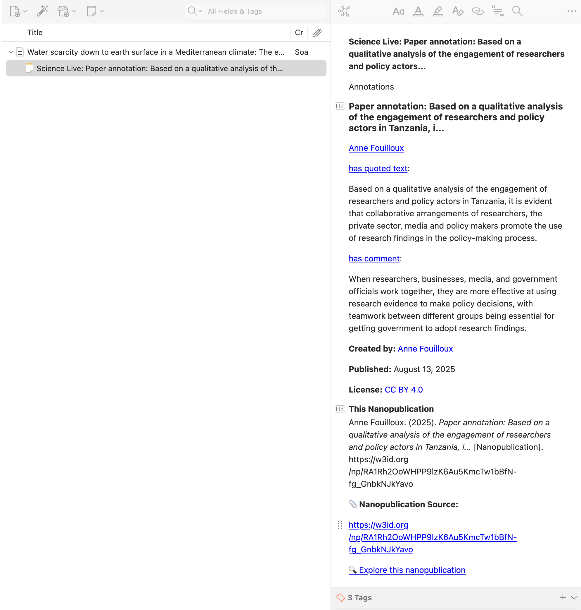

# Features Overview

Transform your Zotero library into a semantic web publishing platform - **all without leaving Zotero!**

## Core Philosophy

The Zotero Nanopublication Plugin brings semantic web publishing directly into your research workflow. **Everything happens in Zotero** - no external websites, no context switching.

---

## 1. Create Nanopublications In-Zotero

Transform bibliography items into semantic, machine-readable statements using an embedded form interface.

### How It Works

1. **Select an item** in your Zotero library
2. **Choose a template** from the template browser
3. **Fill a form** in a new Zotero tab
4. **Publish automatically** - signed and published instantly

### Access Points

**File Menu:**
- File → Create Nanopublication → [Choose Template]

**Right-Click Context Menu:**
- Right-click any item → Create Nanopublication → [Choose Template]

### What You Get

- Embedded form in Zotero tab (powered by `@sciencelivehub/nanopub-create`)
- Auto-filled with item metadata (title, DOI, authors)
- Smart form fields based on template
- Dark mode support (matches Zotero theme)
- Validation before publishing
- Automatic signing with your ORCID
- Direct publishing to nanopub network
- Rich note automatically attached to item

---

## 2. Template Browser

Choose from popular nanopub templates or load any template by URI.

### Built-in Templates

**📝 Research Summary (CiTO)**
- Comment on or evaluate papers
- Describe relationships between papers
- Use Citation Typing Ontology (cites, extends, critiques, etc.)

**🔬 Scientific Claim (AIDA)**
- Make formal research assertions
- Subject-predicate-object statements
- Structured, machine-readable claims

**🌍 Geographical Coverage**
- Identify the geographical area or region covered by the study.
- Support your selection with a quote from the paper.
- Helps document and discover research by spatial scope.

**...and more!**

### How to Browse

1. When creating a nanopub, template browser opens automatically
2. See popular templates with icons and descriptions
3. Click to select

---

## 3. Profile Management

Manage your ORCID identity and cryptographic keys.

### Setup Your Profile

**File → Setup Nanopub Profile**

Enter:
- Your full name
- Your ORCID (with or without https://orcid.org/ prefix)

The plugin:
- Generates RSA key pairs for signing
- Stores keys securely in Zotero's data directory
- Links everything to your ORCID

and

### View Your Profile

**File → Show Nanopub Profile**

See your current:
- Name
- ORCID

---

## 4. Rich Note Generation

Every nanopub you create or import is displayed as a beautifully formatted note.

### Powered by @sciencelivehub/nanopub-view

The notes include:
- Formatted title (extracted from template)
- Author name and ORCID (clickable)
- Publication timestamp
- Your assertion/statement (formatted)
- Provenance information
- Persistent URI (clickable link)
- Interactive buttons:
  - Copy URI
  - Share
  - Cite

### Theme Support

Notes automatically adapt to Zotero's theme:
- ☀️ Light mode: Clean, readable
- 🌙 Dark mode: Eye-friendly colors

---

## 5. Search for Related Nanopublications

Discover what other researchers have published about papers in your library.

### How to Search

1. Right-click any item in your library
2. Select **"Search for Related Nanopublications"**
3. Results appear in a new window

### What You Can Find

- Comments and reviews from other researchers
- Semantic citations with context
- Research claims about the paper
- Related work and connections

### Working with Results

- View full nanopub details
- Import relevant ones to your library
- See who else is citing this work
- Discover research communities

---

## 6. Import Nanopublications

Add existing nanopubs from the network to your Zotero library.

### Method 1: Import as New Item

**File → Import Nanopublication as New Item...**

1. Paste a nanopub URI
2. Plugin fetches the nanopub
3. Creates a new library item with full metadata
4. Rich note included

**Use when:**
- Building a collection of nanopubs
- Tracking semantic statements
- Creating a nanopub library

### Method 2: Attach to Existing Item

**Right-click an item → Attach Nanopublication...**

Or:

**File → Import Nanopublication (Attach to Item)...**

1. Select a target item first (or will be prompted)
2. Paste a nanopub URI
3. Plugin fetches and attaches as a rich note

**Use when:**
- Linking related nanopubs to papers
- Organizing annotations by paper
- Building context around specific items

---

## 7. ORCID Authentication

Your nanopublications are cryptographically signed with your ORCID for:
- Proper attribution
- Verification
- Discoverability
- Academic credit

### How It Works

1. You provide your ORCID during setup
2. Plugin generates RSA key pair
3. Public key is associated with your ORCID
4. Private key signs each nanopub
5. Signature proves you created it

**No passwords sent, no API keys needed** - all handled locally by the plugin using WASM cryptography.

---

## Coming Soon in v2.1

🚧 **PDF Text Selection**

We're working on direct integration with Zotero's PDF viewer:
- Select text directly in PDFs
- Create nanopubs from highlighted passages
- Quote specific sections with attribution
- One-click workflow from highlight to nanopub

**Current workaround:** Copy text from PDFs and paste into form fields when creating nanopubs.

[Follow development →](https://github.com/ScienceLiveHub/zotero-nanopub-plugin)

---

## Menu Reference

### File Menu

- **Setup Nanopub Profile** - First-time setup with ORCID
- **Show Nanopub Profile** - View your current profile
- **Create Nanopublication** → Submenu with templates
- **Import Nanopublication as New Item...** - Add as standalone item
- **Import Nanopublication (Attach to Item)...** - Attach to selected item

### Right-Click Context Menu

- **Create Nanopublication** → Submenu with templates
- **Search for Related Nanopublications** - Find nanopubs about this item
- **Attach Nanopublication...** - Attach existing nanopub

---

## System Requirements

- Zotero 7.0 or later
- Internet connection (for template loading and publishing)
- ORCID account (free at https://orcid.org)

**Supported platforms:**
- Windows 10/11
- macOS 11+ (Intel and Apple Silicon)
- Linux (Ubuntu 20.04+, Fedora 34+)

---

## Technical Details

**Form Generation:** `@sciencelivehub/nanopub-create`  
**Display Rendering:** `@sciencelivehub/nanopub-view`  
**Signing:** nanopub-rs WASM library  
**Storage:** Nanopub network (Knowledge Pixels infrastructure)

---

## Need Help?

- [Quick Start Guide](../getting-started/quick-start.md)
- [Template Types Guide](templates.md)
- [Troubleshooting](../technical/troubleshooting.md)
- [GitHub Issues](https://github.com/ScienceLiveHub/zotero-nanopub-plugin/issues)
