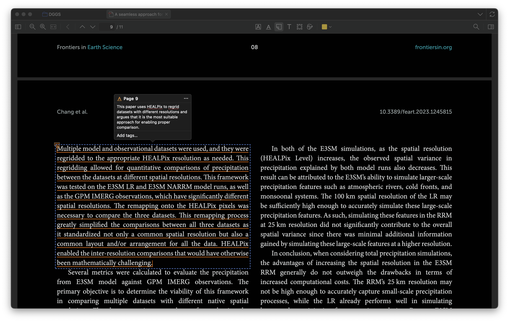
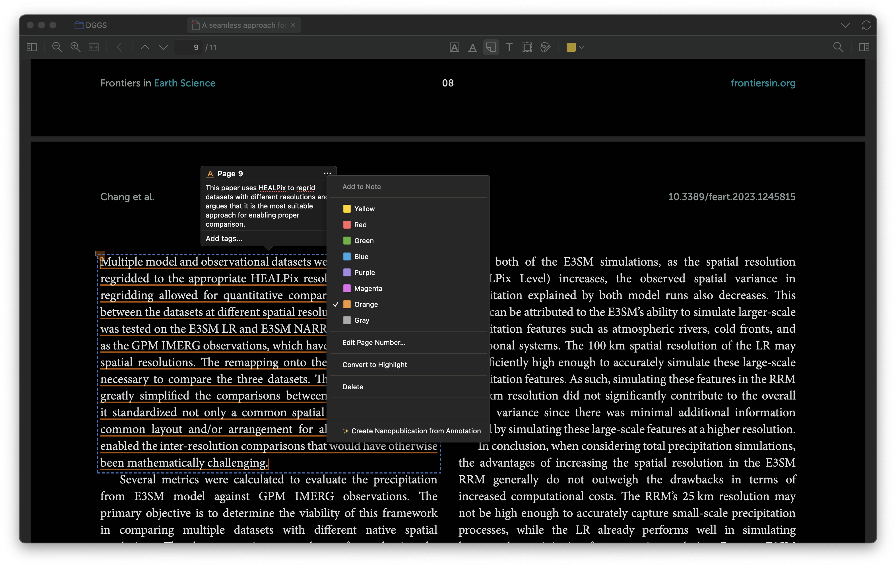
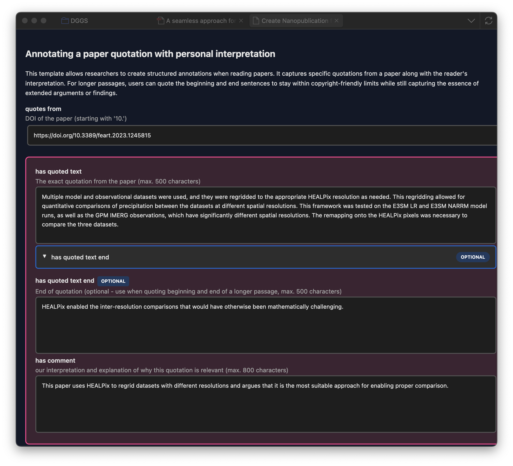
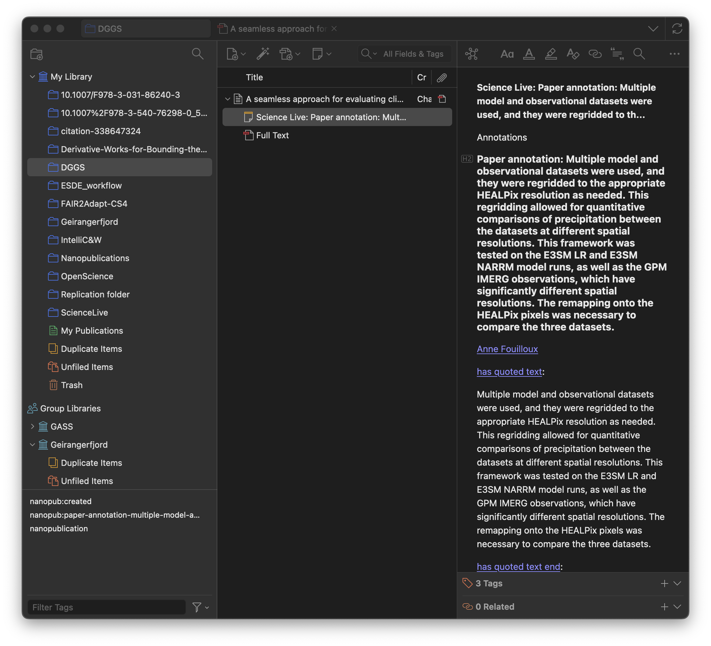

# Creating Nanopublications from PDF Annotations

Turn your PDF highlights and annotations into citable, semantic nanopublications — **directly from Zotero's PDF reader!**

## Prerequisites

- Zotero 7.0+ installed
- Plugin installed ([installation guide](../getting-started/installation.md))
- ORCID account ([get one free](https://orcid.org))
- Profile set up ([quick start guide](../getting-started/quick-start.md))
- A PDF attached to an item in your library

---

## Why Create Nanopubs from PDF Annotations?

When reading a paper, you often highlight key passages or add notes. With the Science Live plugin, you can transform these annotations into **formal, citable nanopublications** that:

- Capture your scholarly insights at the point of reading
- Include the exact text you highlighted
- Link semantically to the source paper
- Are discoverable by other researchers
- Become part of the open knowledge network

---

## Step 1: Open a PDF in Zotero's Reader (30 seconds)

1. In your Zotero library, find an item with an attached PDF
2. **Double-click** the PDF attachment (or the item if it only has one PDF)
3. The PDF opens in Zotero's built-in reader

---

## Step 2: Create a Highlight or Annotation (30 seconds)

Select the text you want to turn into a nanopublication:

**To highlight text:**

1. Click and drag to select the text passage
2. A toolbar appears — click the **highlighter icon** 🖍️
3. Choose a highlight color (optional)

**To add an annotation with a note:**

1. Select the text as above
2. Click the **note icon** 📝 in the toolbar
3. Add your comment or interpretation

!!! tip
    For the best nanopublications, highlight specific claims, findings, or quotes — not entire paragraphs.

---

## Step 3: Create a Nanopublication from Your Annotation (1 minute)

1. Click on the "..." of the annotation box.
2. Hover over **"Create Nanopublication"**

---

## Step 4: Complete the Nanopublication Form (1 minute)

A new tab opens in Zotero with a pre-filled form:

The form automatically includes:

- **Source DOI**: The paper's DOI (from the parent item)
- **Quoted text**: The exact text you highlighted
- **Page number**: Where the annotation appears in the PDF
- **Your ORCID**: From your Science Live profile

**What you need to add:**

- **Your comment** (if using the Comment template): Your interpretation or insight about the quoted text
- **Review the quoted text**: Ensure it captured exactly what you intended

!!! note
    The highlighted text is automatically extracted. If it includes line breaks or formatting issues, you can edit it in the form.

Click **"Create Nanopublication"** when ready.

!!! warning
    The nanopublication is published immediately when you click "Create Nanopublication". Make sure you're happy with the content!

---

## Step 5: View Your Nanopublication

After creation, you'll see a success message.

**Choose where to save the reference:**

- Click **OK** to add the nanopub as a note under your item
- Click **Cancel** to skip (the nanopub is still published)

**Your annotation is now linked:**

- The original PDF annotation shows a nanopub indicator
- A rich note is added to your Zotero item
- The nanopub is live on the nanopub network

---

## What's in the Nanopublication?

Your annotation-based nanopub contains:

| Element | Description |
|---------|-------------|
| **Quoted text** | The exact passage you highlighted |
| **Source paper** | DOI link to the original paper |
| **Page reference** | Where in the PDF the quote appears |
| **Your comment** | Your interpretation (if provided) |
| **Your identity** | Your name and ORCID |
| **Timestamp** | When you created the nanopub |
| **Cryptographic signature** | Proof of authorship |

---

## Best Practices for PDF Annotations

### Do ✅

- **Highlight specific claims**: "Our results show a 40% improvement..."
- **Capture key findings**: Important statistics, conclusions, methods
- **Add meaningful comments**: Your interpretation adds value
- **Keep quotes focused**: Short, citable passages work best

### Don't ❌

- **Highlight entire paragraphs**: Too long for effective nanopubs
- **Skip context**: Make sure the quote makes sense standalone
- **Forget to review**: Check the extracted text for accuracy

