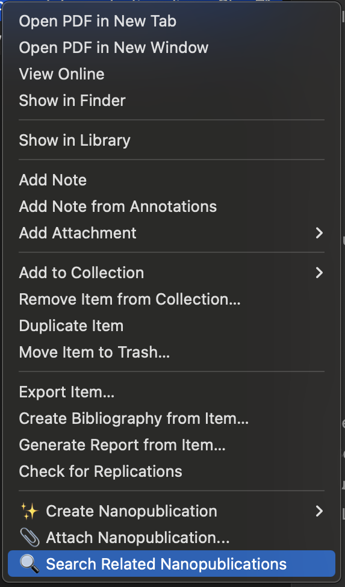
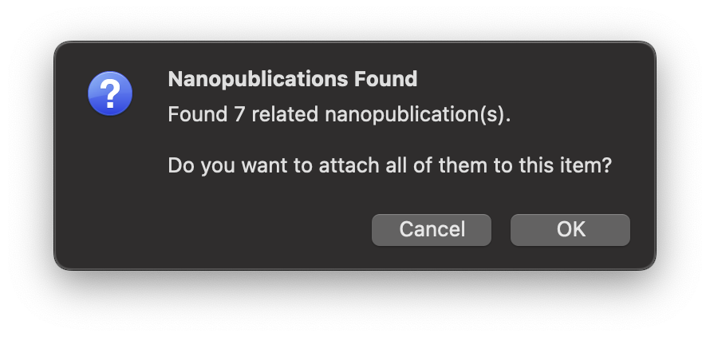
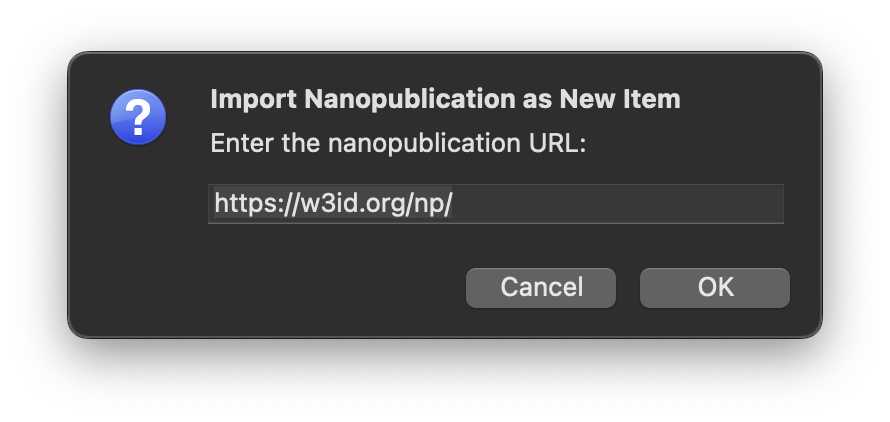
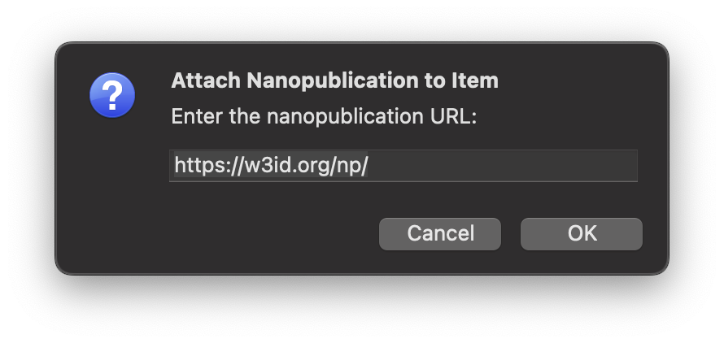

# Search & Discovery

Find, explore, and import nanopublications from the global knowledge network — **all from within Zotero!**

## Overview

The Science Live plugin connects your Zotero library to the worldwide nanopublication network. You can:

- **Search** for nanopublications related to papers in your library
- **Discover** what other researchers have published about your topics
- **Import** nanopublications as new items or attach them to existing papers
- **Explore** the semantic web of scientific knowledge

---

## Searching for Related Nanopublications

Find out what the research community has published about any paper in your library.

### How to Search

**Option A: Right-click menu** (recommended)

1. In your Zotero library, select a paper
2. **Right-click** the item
3. Select **"Search for Related Nanopublications"**

**Option B: Item menu**

1. Select a paper in your library
2. Go to **Item → Search for Related Nanopublications**

### Understanding Search Results

A results panel opens showing nanopublications related to your paper:

At the moment, you can either add all the search results to you item  (click on "OK") or cancel.

Each result is added as a note to your item and displays:

| Element | Description |
|---------|-------------|
| **Title/Label** | The nanopub's main assertion or label |
| **Author** | Creator's name and ORCID |
| **Date** | When the nanopub was published |
| **Type** | Citation, comment, review, etc. |
| **Preview** | Brief summary of the content |

### What Gets Searched

The plugin searches for nanopublications that:

- **Cite your paper** — Other researchers citing this work
- **Comment on your paper** — Reviews, opinions, interpretations
- **Reference your paper's DOI** — Any semantic link to this DOI
- **Share the same topics** — Related subject matter

---

## Importing Nanopublications

Bring nanopublications from the network into your Zotero library.

### Import as New Item

Add a nanopublication as a standalone item in your library.

**When to use:** You found a nanopub you want to reference, cite, or track independently.

**How to import:**

1. Go to **File → Import Nanopublication as New Item**
2. Enter the nanopub URI (e.g., `https://w3id.org/np/RAbc123...`)
3. Click **Import**

**Result:** A new item appears in your library with:

- The nanopub's metadata (title, author, date)
- A rich note containing the full nanopub content
- Links to view the nanopub online
- The original URI for citation

### Attach to Existing Item

Link a nanopublication to a paper already in your library.

**When to use:** You found a nanopub that comments on or cites a paper you have.

**Option A: File menu**

1. Select the item you want to attach the nanopub to
2. Go to **File → Import Nanopublication (Attach to Item)**
3. Enter the nanopub URI
4. Click **Attach**

**Option B: Right-click menu**

1. **Right-click** the item
2. Select **"Attach Nanopublication"**
3. Enter the nanopub URI
4. Click **Attach**

**Result:** The nanopub is added as a child note under your item:

- Formatted display of the nanopub content
- Author and publication information
- Link to view online
- Semantic connection preserved

### Citing Discovered Nanopubs

When you find valuable nanopubs, you can cite them:

1. Import the nanopub to your library
2. Use Zotero's citation tools as usual
3. The URI provides a permanent, verifiable reference

---

## Privacy & Data

### What's Shared When Searching

When you search for related nanopubs:

- Only the paper's **DOI** is sent to the nanopub network
- Your identity and library contents are **not shared**
- Search queries are not logged or tracked

### Importing is Safe

When you import nanopubs:

- The nanopub content is fetched from the public network
- No personal information is transmitted
- Imports are stored locally in your Zotero library

---

## Common Questions

**Q: How often should I search for related nanopubs?**  
A: For active research projects, check periodically (e.g., monthly). The nanopub network is growing, so new content appears regularly.

**Q: Can I search for nanopubs about papers not in my library?**  
A: Currently, you need the paper in your library first. Add the paper, then search for related nanopubs.

**Q: What if I find incorrect or problematic nanopubs?**  
A: Nanopubs are permanent and attributed to their creators. You can publish a response nanopub or contact the author via their ORCID.

**Q: Do imported nanopubs sync across devices?**  
A: Yes, if you use Zotero sync, imported nanopubs (stored as notes) sync like any other Zotero content.

**Q: Can I export my search results?**  
A: You can import selected results to your library, then export using Zotero's standard export features.

**Q: How do I know if a nanopub is trustworthy?**  
A: Nanopubs are cryptographically signed with the creator's ORCID. Check the author's credentials and institutional affiliation.

