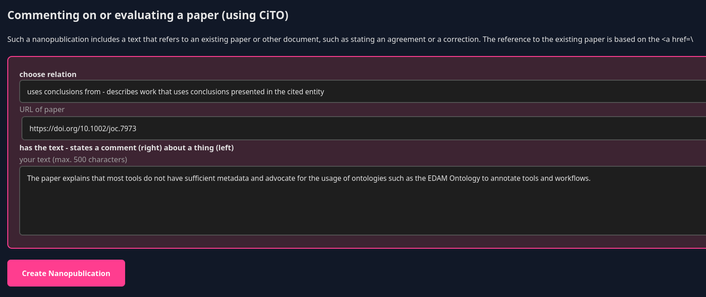

# Template Types

Choose the right template for your semantic statement. All templates are loaded and rendered **in Zotero** - no external tools needed!

## Template Overview

| Template | Icon | Best For | Complexity |
|----------|------|----------|------------|
| **Citation with CiTO** | 📝 | Paper relationships | Easy |
| **Comment on a paper** | 📝 | Add personal comments on a paper | Easy |
| **Annotate a paper quotation** | 📝 | Add personal comments/notes attached to a paper quotation | Easy when used from Zotero PDFViwer |
| **Scientific Claim (AIDA)** | 🔬 | Formal research assertions | Medium |
| **Geographical Coverage** | 🌍 | Document the geographical area or region covered by the study. | Medium |

---

## Citation with CiTO

### What is CiTO?

CiTO (Citation Typing Ontology) provides structured ways to describe **why** you're citing a paper, not just **that** you cited it.

### When to Use
Use it if you do not need to add a personal comment e.g. when the options in the dropdown menu are sufficient to explain why you are citing this paper.

When you select this template, the form in Zotero includes:

**1. Article Being Cited** 

- DOI or URI
- Citation string

**2. Relationship Type** (dropdown)
Choose from CiTO relationships:

**Agreement & Support:**

- `agrees_with` - I agree with statements in this paper
- `confirms` - I confirm findings from this paper
- `supports` - I provide supporting evidence

**Extension & Building:**

- `extends` - I extend ideas from this paper
- `updates` - I update information in this paper

**Critique:**

- `critiques` - I critique this paper
- `disagrees_with` - I disagree with this paper
- `disputes` - I dispute claims in this paper

**Methods & Data:**

- `uses_method_in` - I use methods from this paper
- `uses_data_from` - I use data from this paper

**Discussion:**

- `discusses` - I discuss this paper
- `reviews` - I review this paper

### Example Workflow

**Scenario:** You read a paper and agrees with it

1. Select paper in Zotero: "Heat-related mortality amplified during the COVID-19 pandemic"
2. Right-click → Create Nanopublication → 📝 Citation with CiTO
3. Form opens with paper DOI pre-filled
4. Choose relationship: `agrees with - agrees with statements, ideas or conclusions presented in the cited entity`

Check our video to see it in action:

<iframe width="760" height="560" src="https://www.youtube.com/embed/N4swx_7GXRU" frameborder="0" allowfullscreen></iframe>

## Comment on a paper

It also uses CiTO to qualify **why** you're citing a paper but you can also add a personal comment from the paper.

### When to Use

- Literature reviews
- Annotating your bibliography
- Describing paper relationships
- Building citation context
- Academic evaluations

### Form Fields

When you select this template, the form in Zotero includes:

**1. Article Being Cited** 

- DOI or URI
- Citation string

**2. Relationship Type** (dropdown)
Choose from CiTO relationships (see CiTO example above).

**3. Your Comment** (text area)
Explain your relationship in natural language.

### Example Workflow

**Scenario:** You're reviewing a machine learning paper

1. Select paper in Zotero: "Galaxy: A Decade of Realising CWFR Concepts" (DOI: 10.1162/dint_a_00136)
2. Right-click → Create Nanopublication →  Comment on a paper
3. Form opens with paper info pre-filled
4. Choose relationship: `uses conclusions from`
5. Add text:

```
The paper explains that most tools do not have sufficient metadata and advocate for the usage of ontologies such as the EDAM Ontology to annotate tools and workflows.
```

6. Click "Create Nanopublication"
7. Done! A rich note is attached to the paper.

**Result:** A semantic statement saying "I uses conclusions `The paper explains that most tools do not have sufficient metadata and advocate for the usage of ontologies such as the EDAM Ontology to annotate tools and workflows.` from https://doi.org/10.1162/dint_a_00136"



---

## Scientific Claim (AIDA)

### What is AIDA?

AIDA statements are structured scientific claims that are:
- **A**tomic - One claim per nanopub
- **I**ndependent - Stands alone
- **D**eclarative - Makes a clear statement
- **A**bsolute - No ambiguity

### When to Use

- Documenting research findings
- Making formal assertions
- Recording observations
- Stating experimental results
- Machine-readable claims

### Form Fields

**1. AIDA Sentence** - The AIDA Sentence

- Example: "ImageNet introduces a revolutionary 3.2-million image database with 99.7% accuracy across 5,247 hierarchical categories, offering computer vision researchers an unprecedented training resource that's 100× larger than existing datasets and freely available at image-net.org."

**2. Subject** - What the claim is about

- Example: "ImageNet" (http://www.wikidata.org/entity/Q24901201)
- Is a URI (Wikidata)

**2. Predicate** - The relationship or property

- Example: "interacts_with"
- Often a URI from an ontology

**3. Object** - What it relates to

- Example: "Protein XYZ"

**4. Context** (optional) - Conditions and qualifiers

- Example: "in human HeLa cells at pH 7.4"

**5. Paper Reference** (auto-filled from selected item)

- Evidence for your claim

![Screenshot: AIDA template form in Zotero]

### Example Workflow

**Scenario:** You discovered a protein interaction

1. Select paper in Zotero (your own paper or source paper)
2. Right-click → Create Nanopublication → 🔬 Scientific Claim
3. Fill form:

   - **Subject:** `http://purl.uniprot.org/uniprot/P12345` (Protein A)
   - **Predicate:** `http://purl.obolibrary.org/obo/RO_0002436` (interacts_with)
   - **Object:** `http://purl.uniprot.org/uniprot/Q67890` (Protein B)
   - **Context:** "Observed in HeLa cells under standard conditions"

4. Click "Create & Publish"

**Result:** A machine-readable claim:
> Protein A interacts with Protein B (in HeLa cells)

This can be queried by databases and knowledge graphs!

---

# Geographical Coverage Template Documentation

Add this section to your `docs/user-guide/templates.md` file:

---

## Geographical Coverage

### What is the Geographical Coverage Template?

The Geographical Coverage template allows you to document the geographical area, region, or location covered by a research paper, dataset, or study. This enables spatial queries and helps researchers discover work relevant to specific locations.

### When to Use

- Documenting study areas for research papers
- Describing spatial extent of datasets
- Mapping research to geographical regions
- Enabling location-based discovery
- Linking research to specific places
- Environmental and earth science research
- Social science studies with geographical focus

### Use Cases

**Environmental Research:**

- "This paper studies deforestation in the Amazon Basin"
- "Data collected from the Arctic Circle region"

**Social Science:**

- "Survey conducted in Northern Europe"
- "Study covers urban areas in Southeast Asia"

**Earth Science:**

- "Geological samples from the Langhe region, Italy"
- "Climate data for the Mediterranean Basin"

**Biodiversity:**

- "Species observations in the Great Barrier Reef"
- "Forest inventory covering Scandinavia"

### Form Fields

When you select this template, the form in Zotero includes:

#### **1. Paper Reference**
The research paper, dataset, or study being documented:

- DOI or URI
- Title and citation information
- Pre-filled from your selected Zotero item

**Example:** `https://doi.org/10.1234/example.2024`

---

#### **2. Location Identifier** (required)
A unique identifier for the geographical area:

- Creates a URI for the location
- Use lowercase with hyphens
- Should be descriptive and memorable

**Examples:**

- `amazon-basin`
- `langhe-region-italy`
- `northern-europe`
- `great-barrier-reef`
- `arctic-circle`

---

#### **3. Name of Geographical Area** (required)
The human-readable name of the location:

- Use proper capitalization
- Include country/region context if needed
- Be as specific as necessary

**Examples:**

- "Amazon Basin"
- "Langhe region, Italy"
- "Northern Europe"
- "Great Barrier Reef, Australia"
- "Arctic Circle"
- "Mediterranean Basin"

---

#### **4. Geometry Details (WKT format)** (optional, collapsible)

For precise spatial definitions, you can provide geometry coordinates:

**Geometry Identifier:**

- Identifier for the geometry object
- Auto-filled as `{location-id}-geometry`
- Example: `langhe-region-italy-geometry`

**WKT Coordinates:**

- Well-Known Text format
- Enables spatial queries
- Supports points, lines, and polygons

**WKT Format Examples:**

**Point (single location):**
```
POINT(2.3522 48.8566)
```
↑ Coordinates for Paris (longitude, latitude)

**Polygon (area boundary):**
```
POLYGON((7.5 44.3, 8.5 44.3, 8.5 44.9, 7.5 44.9, 7.5 44.3))
```
↑ Rectangular boundary (longitude/latitude pairs, first point repeated at end)

**Line (route or transect):**
```
LINESTRING(0 0, 1 1, 2 2)
```

**💡 Resources:**
- [WKT on Wikipedia](https://en.wikipedia.org/wiki/Well-known_text_representation_of_geometry)
- [WKT Quick Reference](https://libgeos.org/specifications/wkt/)
- Use [geojson.io](https://geojson.io) to draw and convert geometries

---

### Example Workflow

**Scenario:** You're documenting a climate study covering the Langhe wine region in Italy

1. Select the climate paper in Zotero
2. Right-click → Create Nanopublication → 📍 Document geographical coverage
3. Form opens with paper info pre-filled
4. Fill in:
   - **Location identifier:** `langhe-region-italy`
   - **Name:** `Langhe region, Italy`
   - (Optional) Click to expand geometry section:
     - **Geometry ID:** Auto-filled as `langhe-region-italy-geometry`
     - **WKT:** `POLYGON((7.5 44.3, 8.5 44.3, 8.5 44.9, 7.5 44.9, 7.5 44.3))`
5. Click "Create & Publish"

**Result:** A machine-readable nanopublication stating:
> Paper [DOI] covers the geographical area "Langhe region, Italy" with precise coordinates

---

### Why Add Geometry?

**Without geometry:**
- Location is referenced by name only
- Text-based search only
- No spatial queries possible

**With geometry (WKT):**
- Enables spatial queries: "Show all research within 50km of this point"
- GIS integration: Import into mapping software
- Precise boundaries: Exact area definition
- Overlap detection: Find studies covering the same region
- Map visualization: Display on interactive maps

---

### Best Practices

#### ✅ **DO:**

**Be specific enough:**
- ✅ "Amazon Basin, Brazil" (specific region)
- ❌ "South America" (too broad, unless that's the actual scope)

**Use consistent naming:**
- Follow standard geographical names
- Include country/context when needed
- Use English names for broader discoverability

**Provide geometry when precision matters:**
- Environmental studies: exact sampling areas
- Climate research: precise regions
- Biodiversity: habitat boundaries

**Use appropriate geometry types:**
- Study site = POINT
- Survey transect = LINESTRING
- Study area = POLYGON

#### ❌ **DON'T:**

**Don't be too vague:**
- ❌ "Europe" (unless paper truly covers all of Europe)
- ❌ "The region" (which region?)

**Don't mix geometry types:**
- Use one geometry per nanopub
- Create multiple nanopubs for multiple distinct areas

**Don't guess coordinates:**
- Only add WKT if you have accurate data
- Leave optional if unsure

---

### Technical Details

**Ontology:** Uses standard geographical vocabularies and GeoSPARQL

**Output Format:** RDF with spatial predicates

**Enables:**
- SPARQL spatial queries
- GIS software integration
- Location-based discovery
- Map-based visualization

**Example Query:**
"Find all research papers covering locations within 100km of this point"

---

### Integration with Science Live Platform

When published to the nanopub network, geographical coverage nanopubs:
- Enable map-based browsing of research
- Support location-based recommendations
- Connect research to places
- Build geographical knowledge graphs

---

### Finding Coordinates

**Option 1: Google Maps**
1. Right-click location on Google Maps
2. Click coordinates to copy
3. Format as `POINT(longitude latitude)`

**Option 2: OpenStreetMap**
1. Visit [openstreetmap.org](https://www.openstreetmap.org/)
2. Find your location
3. Right-click → "Show address" shows coordinates

**Option 3: geojson.io**
1. Visit [geojson.io](https://geojson.io)
2. Draw your area on the map
3. Copy WKT format from the right panel

**Option 4: Bounding Box Tool**
1. Visit [bboxfinder.com](http://bboxfinder.com/)
2. Draw rectangle around your area
3. Get coordinates for polygon

---

### Real-World Examples

#### Example 1: Marine Biology Study
- **Location:** `great-barrier-reef-australia`
- **Name:** `Great Barrier Reef, Australia`
- **Geometry:** Complex polygon covering reef extent
- **Use:** Enables queries like "All coral research in GBR"

#### Example 2: Climate Research
- **Location:** `arctic-circle`
- **Name:** `Arctic Circle`
- **Geometry:** Circular boundary at 66.5°N latitude
- **Use:** Groups all Arctic climate studies

#### Example 3: Agricultural Study
- **Location:** `langhe-piedmont-italy`
- **Name:** `Langhe wine region, Piedmont, Italy`
- **Geometry:** Precise vineyard boundaries
- **Use:** Track viticulture research by location

#### Example 4: Urban Study
- **Location:** `greater-oslo-norway`
- **Name:** `Greater Oslo Metropolitan Area, Norway`
- **Geometry:** City boundary polygon
- **Use:** Compare urban studies across cities

---

### Common Patterns

**Single Site Study:**
```
Location: field-station-costa-rica
Name: La Selva Biological Station, Costa Rica
Geometry: POINT(-84.0 10.4)
```

**Regional Survey:**
```
Location: scandinavian-mountain-range
Name: Scandinavian Mountains
Geometry: POLYGON((complex coordinates))
```

**Multiple Sites:**
Create separate nanopubs for each distinct site, or use:
```
Location: mediterranean-sampling-sites
Name: Mediterranean Sea Sampling Network
Geometry: MULTIPOINT((2.3 43.3), (12.5 41.9), (23.7 37.9))
```

---

### Troubleshooting

**"I don't know the exact coordinates"**
- Leave geometry section collapsed (optional)
- The named location is still valuable

**"My study area is complex"**
- Use a bounding box (rectangle) as approximation
- Or use geojson.io to trace the boundary

**"Should I use country names?"**
- Yes, if the entire country is the study area
- Add context: "Northern Italy" not just "Italy" if more specific

**"What if location has multiple names?"**
- Use the most common English name
- Include local name in brackets: "Prague (Praha), Czech Republic"

---

### Learn More

- **GeoSPARQL:** [Standard for spatial queries](https://www.ogc.org/standards/geosparql)
- **WKT Format:** [Well-Known Text specification](https://en.wikipedia.org/wiki/Well-known_text_representation_of_geometry)
- **Nanopub Spatial:** Research on spatial nanopublications
- **Science Live Maps:** Location-based research discovery (coming soon)

---

## Technical Details

All templates generate RDF (Resource Description Framework) in TriG format, ensuring:
- Machine readability
- Semantic web compatibility
- Integration with knowledge graphs
- FAIR data principles (Findable, Accessible, Interoperable, Reusable)

---

## Learn More

- **Nanopub.net:** [http://nanopub.net](http://nanopub.net)

---

## Next Steps

- [Create your first nanopub →](../getting-started/quick-start.md)
